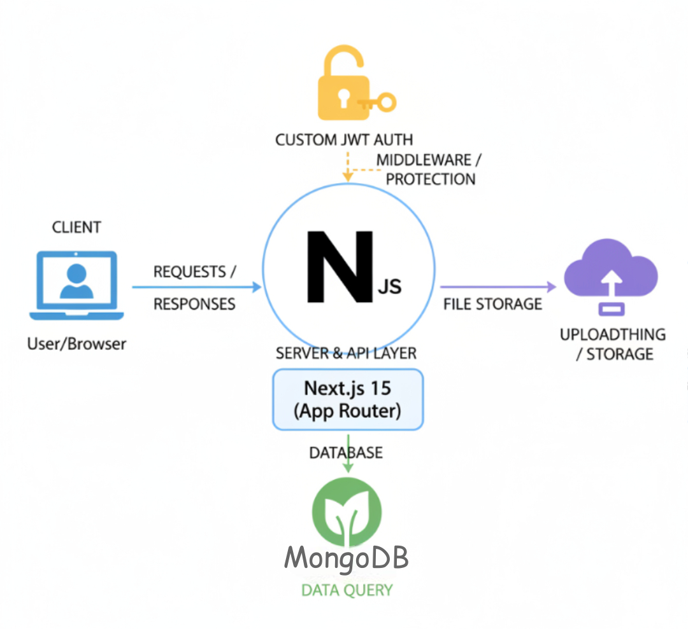

# Next Level Food (Meals App)

A Next.js application for sharing and discovering delicious recipes. This platform allows users to browse meals, view details, and share their own culinary creations with the community.

## Features

- **Browse Meals**: Explore a collection of shared recipes with images and summaries.
- **Share Recipes**: Authenticated users can upload their own meals.
- **User Authentication**: Custom JWT-based authentication system (Sign up, Login, Logout).
- **Image Upload**: Integration with UploadThing (or similar service) for storing meal images.
- **Responsive Design**: Modern and responsive UI built with CSS Modules.

## Tech Stack

- **Framework**: [Next.js 15](https://nextjs.org/) (App Router)
- **Language**: TypeScript
- **Database**: MongoDB (with Mongoose ODM)
- **Authentication**: Custom JWT implementation using `jsonwebtoken` and `bcrypt`
- **Data Fetching**: SWR for client-side state, Server Components for initial data
- **Styling**: CSS Modules

## Architecture



## Getting Started

### Prerequisites

- Node.js (v18+ recommended)
- MongoDB instance (Local or Atlas)

### Installation

1. **Clone the repository:**
   ```bash
   git clone <repository-url>
   cd next-app
   ```

2. **Install dependencies:**
   ```bash
   npm install
   ```

3. **Environment Variables:**
   Create a `.env` file in the root directory and add the following variables:
   ```env
   DB_URI=mongodb+srv://<username>:<password>@<cluster>.mongodb.net/<dbname>
   JWT_SECRET=your_super_secret_jwt_key
   # Add other necessary variables (e.g., for image upload)
   ```

4. **Run the development server:**
   ```bash
   npm run dev
   ```

5. **Open the app:**
   Visit [http://localhost:3000](http://localhost:3000) in your browser.

## Project Structure

- `app/`: Main application routes (App Router).
  - `(auth)`: Authentication routes (Login, Signup).
  - `(pages)`: Public pages (Meals, Community, etc.).
  - `api/`: Backend API routes.
- `components/`: Reusable UI components.
- `lib/`: Backend utilities (Database connection, Auth helpers).
- `models/`: Mongoose data models.
- `context/`: React Context providers (Auth, Theme).

## License

This project is licensed under the MIT License.
