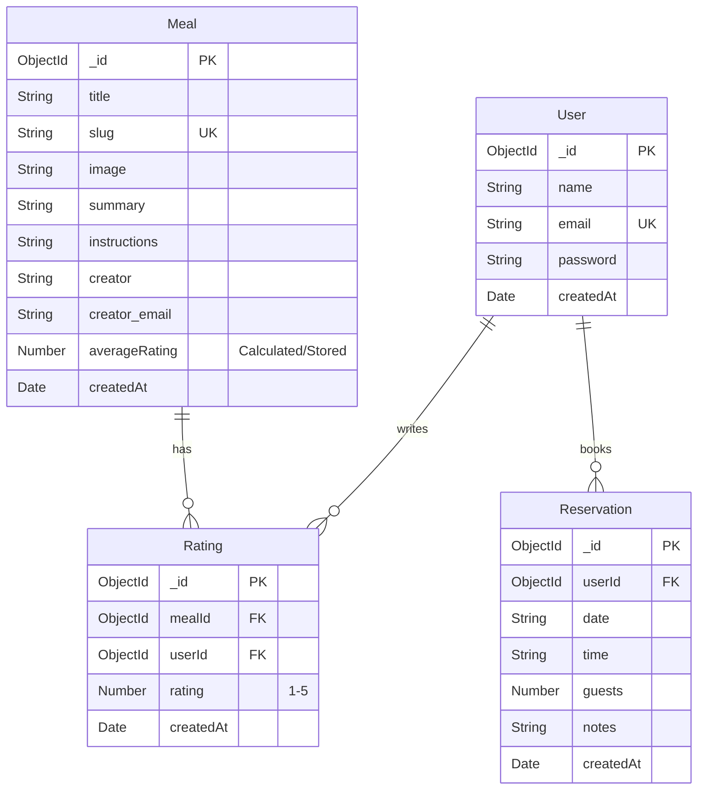

# Database Schema Relationship Diagram

Shows how MongoDB models are related

### Relationships

1. **User and Rating**: A user can leave more than one rating.
2. **User and Reservation**: A user cannot make more than one reservation.
3. **Meal and Rating**: A meal can have more than one rating.

### Notes
- **User**: Central entity for authentication.
- **Meal**: Core content. `averageRating` is currently calculated via aggregation but technically exists in the schema.
- **Rating**: Junction table linking Users and Meals with a score.
- **Reservation**: Linked directly to User.
